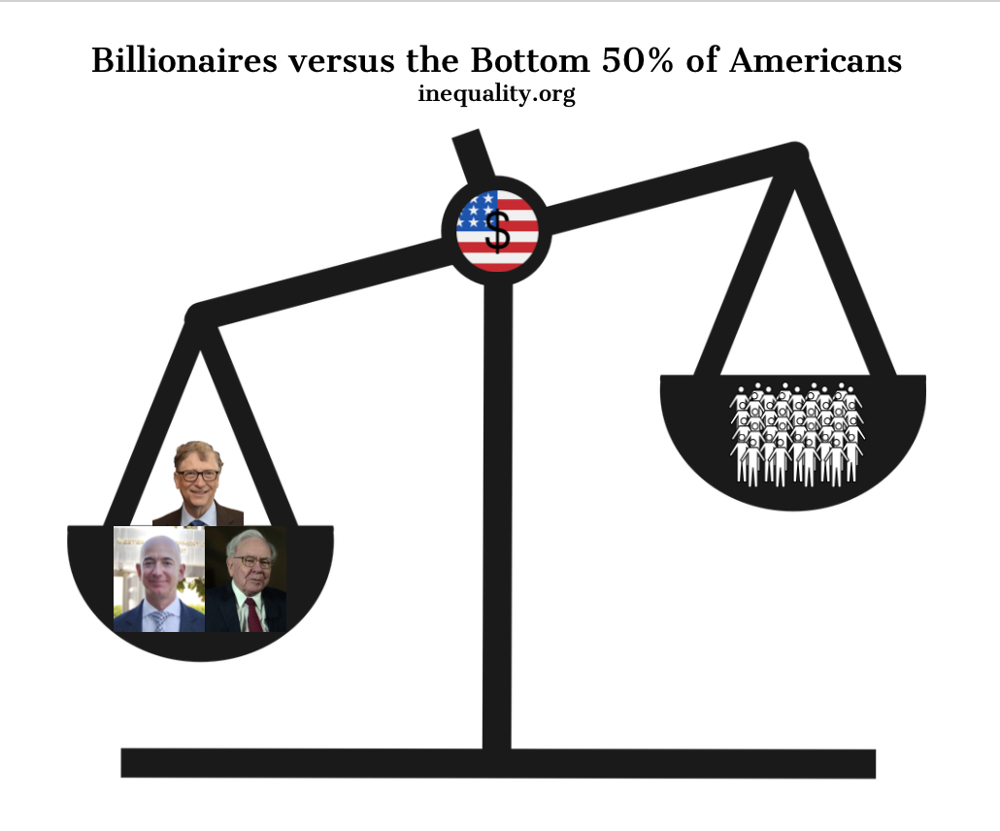
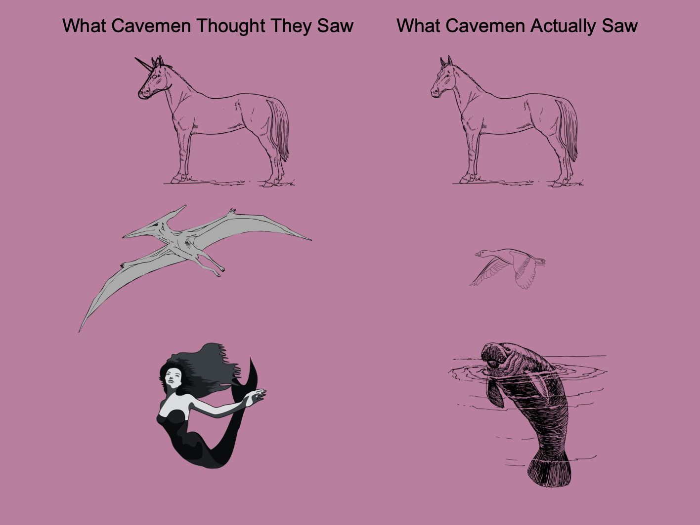
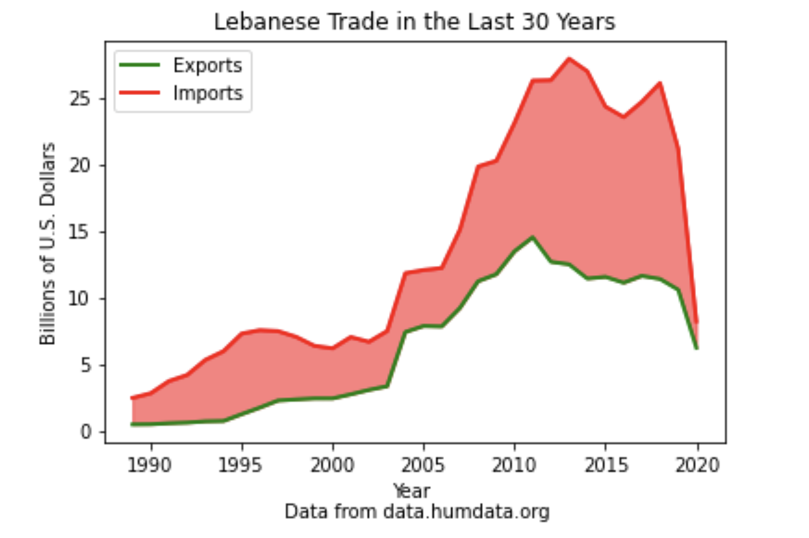
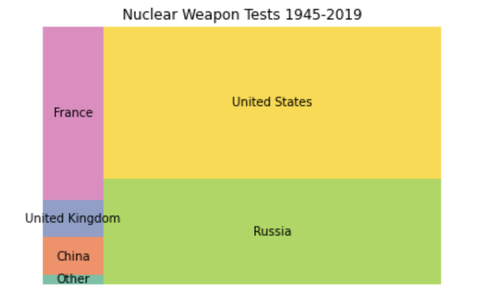
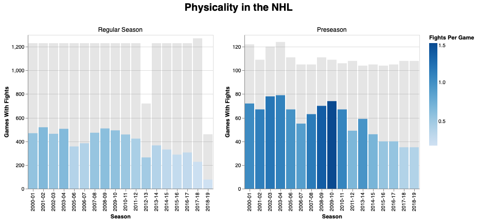
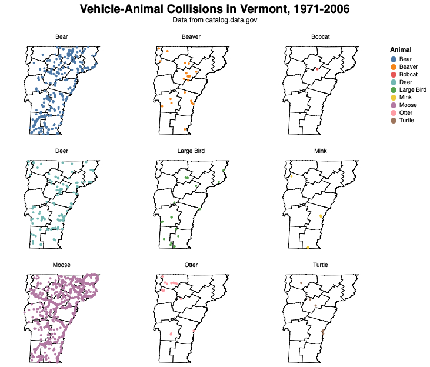
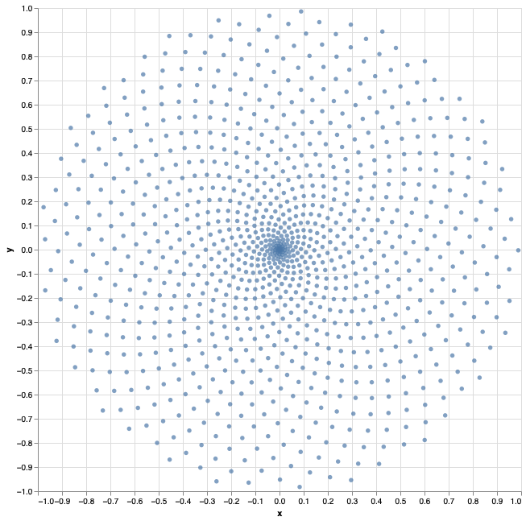
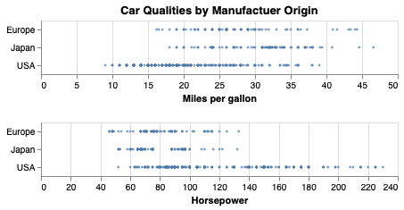
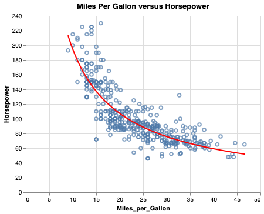

# CSC630 Portfolio
## 30-Day Challenge
### Direct Links
- [Part-To-Whole Comparison](PartToWhole.jpeg)
- [Pictogram Comparison](Pictogram.png)
- Historical Comparison
- [Magical Comparison](Magical.png)
- [Slope Comparison](LebanonTrade.png)
- [Experimental Comparison](NuclearTests.png)
- [Physical Distribution](HockeyFights.png)
- [Animal Distribution](VermontAnimalCollisions.png)
- [Statistics Distribution](NBAStats.pdf)
- Abstract Distribution
- [Circular Distribution](SunflowerSpiral.png)
- [Strips Distribution](Strips.png)
- [Correlation Relationship](MoreCarStuff.png)
- Space Relationship
- Multivariate Relationship
### Task 4
- Geographical visualization. (I did my best) [Download MacOS App](https://github.com/cabouezzi22/CSC630-Portfolio/raw/main/BostonCommute.zip)

### 30-Day Challenge Portfolio

